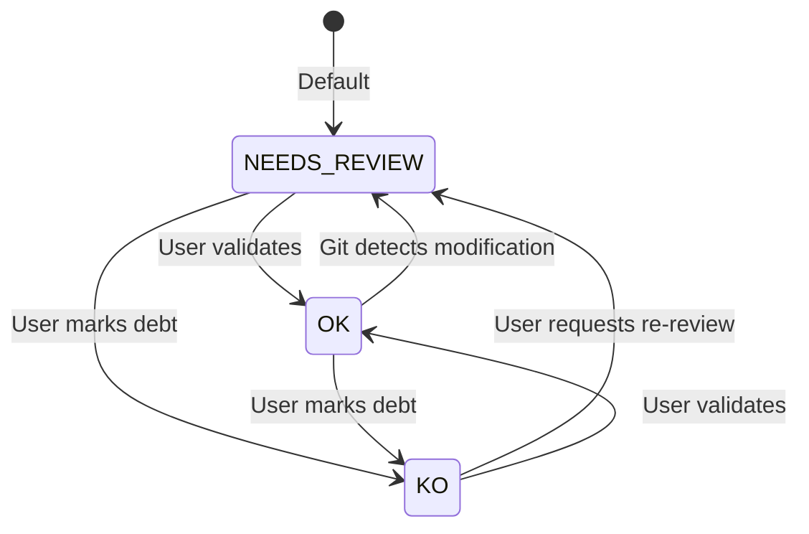
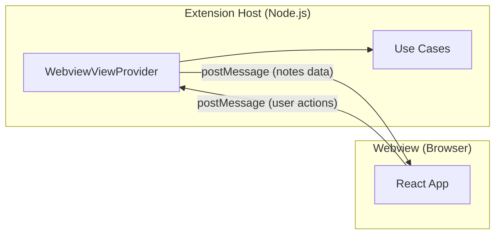
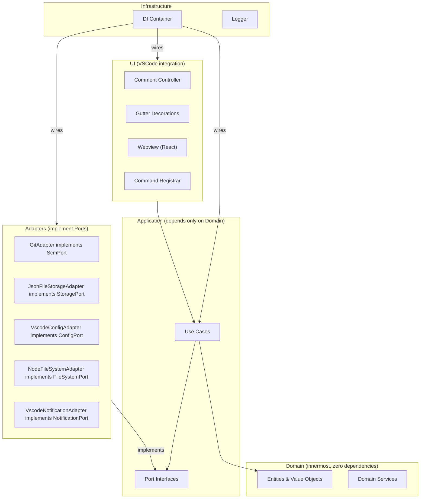

# CodeSentinel -- Full Technical Architecture Plan

---

## 1. Consolidated Design Decisions

All decisions locked from the clarification phase:

- **Note identity on rename**: Auto-follow file renames via Git rename detection
- **Deleted lines**: Auto-delete the note
- **Priority model**: User-configurable named levels with ordering; defaults: CRITICAL / HIGH / MEDIUM / LOW / INFO
- **Note status lifecycle**: User-configurable; defaults: OPEN / IN_PROGRESS / RESOLVED / WONTFIX
- **Multi-root workspaces**: Not in MVP; architecture designed to support it later
- **Storage folder**: `.codesentinel/` at workspace root, Git-tracked
- **Git tracking mode**: First-time setup wizard asks user to choose (shared vs. personal)
- **Note authorship**: Derived from Git `user.name` / `user.email`
- **Merge conflicts**: Manual Git merge (standard text conflict resolution)
- **File status scope**: All Git-tracked files default to `NEEDS_REVIEW`, with configurable default status and exclusion patterns
- **Note creation UX**: VSCode Comment API (native comment thread UX)
- **Language**: TypeScript strict + ESLint + Prettier
- **Bundler**: esbuild (separate configs for extension and webview)
- **Tests**: Vitest for unit tests + `@vscode/test-electron` for integration tests
- **Package manager**: pnpm
- **Webview framework**: React
- **Note types (defaults)**: TECHNICAL_DEBT / IMPROVEMENT / WARNING / BUG / TODO
- **Note scopes (defaults)**: PERFORMANCE / SECURITY / MAINTAINABILITY / ARCHITECTURE / READABILITY

---

## 2. Domain Modeling

### 2.1 Entities

**Note** (Aggregate Root)

```typescript
interface Note {
  readonly id: NoteId;
  filePath: FilePath;
  anchor: ContentAnchor;
  content: string;
  priority: Priority;
  type: NoteType;
  scope: NoteScope;
  status: NoteStatus;
  author: Author;
  readonly createdAt: Date;
  updatedAt: Date;
}
```

**FileHealth** (Aggregate Root)

```typescript
interface FileHealth {
  readonly filePath: FilePath;
  status: FileStatusValue;
  lastValidatedCommit: CommitHash | null;
  lastValidatedAt: Date | null;
  validatedBy: Author | null;
}
```

### 2.2 Value Objects

```typescript
// Branded types for type safety
type NoteId = string & { readonly __brand: 'NoteId' };
type FilePath = string & { readonly __brand: 'FilePath' };
type CommitHash = string & { readonly __brand: 'CommitHash' };

interface LineRange {
  readonly startLine: number; // 1-based
  readonly endLine: number;   // 1-based, inclusive
}

interface ContentAnchor {
  readonly lineRange: LineRange;
  readonly contentHash: string;  // SHA-256 of line contents at creation
  readonly snippet: string;      // First 120 chars for fuzzy matching
}

interface Priority {
  readonly name: string;
  readonly ordinal: number; // Lower = higher priority
}

interface Author {
  readonly name: string;
  readonly email: string;
}

type NoteType = string & { readonly __brand: 'NoteType' };
type NoteScope = string & { readonly __brand: 'NoteScope' };
type NoteStatus = string & { readonly __brand: 'NoteStatus' };

enum FileStatusValue {
  OK = 'OK',
  NEEDS_REVIEW = 'NEEDS_REVIEW',
  KO = 'KO',
}
```

### 2.3 Domain Invariants

- `LineRange.startLine >= 1` and `endLine >= startLine`
- `Note.content` must be non-empty (trimmed length > 0)
- `Note.priority` must reference a priority defined in the project configuration
- `Note.type`, `Note.scope`, `Note.status` must reference values defined in configuration
- `FileHealth.lastValidatedCommit` must be non-null when status is `OK`
- `ContentAnchor.contentHash` is computed at creation and updated on successful re-anchoring

### 2.4 Domain Services

**LineAnchorService** -- Responsible for resolving and re-anchoring notes after file changes.

```typescript
interface LineAnchorService {
  createAnchor(fileContent: string, lineRange: LineRange): ContentAnchor;
  resolveAnchor(fileContent: string, anchor: ContentAnchor): AnchorResolution;
}

type AnchorResolution =
  | { status: 'exact'; lineRange: LineRange }
  | { status: 'drifted'; lineRange: LineRange; newHash: string }
  | { status: 'lost' };
```

Algorithm:

1. Extract content at stored line range, compute hash
2. If hash matches -> `exact` (no drift)
3. If not, search +/-30 lines for a block whose hash matches -> `drifted`
4. If no hash match, fuzzy-search using snippet (Levenshtein distance < 30%) -> `drifted`
5. If nothing found -> `lost` (note will be auto-deleted)

**FileStatusTransitionService** -- Manages valid state transitions for FileHealth.

### 2.5 FileHealth State Transitions




Transition rule: `OK -> NEEDS_REVIEW` is the **only automatic transition**. All others are user-initiated.

---

## 3. Storage Strategy

### 3.1 Chosen Model: Hybrid (per-source-file JSON)

One JSON file per annotated source file, mirroring the source path:

```
.codesentinel/
  config.json
  notes/
    src/
      components/
        Button.tsx.json
      utils/
        helpers.ts.json
    README.md.json
```

**Justification over alternatives**:

- **Single-file model**: All notes in one file means every edit conflicts. Rejected for team use.
- **Per-note model** (one file per note): Thousands of tiny files. Noisy in Git diffs and file explorers. Over-engineered for MVP.
- **Hybrid (per-source-file)**: Two developers working on different source files never conflict. Within the same file, conflicts are rare (different notes = different JSON array entries). Notes for the same file are co-located, easy to inspect manually.

### 3.2 JSON Schema

`**.codesentinel/config.json`**:

```json
{
  "version": 1,
  "priorities": [
    { "name": "CRITICAL", "ordinal": 0, "color": "#DC2626" },
    { "name": "HIGH", "ordinal": 1, "color": "#EA580C" },
    { "name": "MEDIUM", "ordinal": 2, "color": "#CA8A04" },
    { "name": "LOW", "ordinal": 3, "color": "#16A34A" },
    { "name": "INFO", "ordinal": 4, "color": "#2563EB" }
  ],
  "types": ["TECHNICAL_DEBT", "IMPROVEMENT", "WARNING", "BUG", "TODO"],
  "scopes": ["PERFORMANCE", "SECURITY", "MAINTAINABILITY", "ARCHITECTURE", "READABILITY"],
  "statuses": ["OPEN", "IN_PROGRESS", "RESOLVED", "WONTFIX"],
  "fileStatusDefaults": {
    "defaultStatus": "NEEDS_REVIEW",
    "excludePatterns": ["*.test.ts", "*.spec.ts", "*.d.ts", "dist/**", "node_modules/**"]
  }
}
```

**Per-source-file JSON** (e.g., `.codesentinel/notes/src/utils/helpers.ts.json`):

```json
{
  "version": 1,
  "filePath": "src/utils/helpers.ts",
  "fileStatus": {
    "status": "OK",
    "lastValidatedCommit": "a1b2c3d4e5f6",
    "lastValidatedAt": "2026-03-27T10:00:00.000Z",
    "validatedBy": { "name": "John Doe", "email": "john@example.com" }
  },
  "notes": [
    {
      "id": "550e8400-e29b-41d4-a716-446655440000",
      "anchor": {
        "startLine": 42,
        "endLine": 48,
        "contentHash": "sha256:e3b0c44298fc1c149afbf4c8996fb924...",
        "snippet": "function processData(input: string[]): Result {"
      },
      "content": "O(n^2) complexity -- consider using a Map for lookups",
      "priority": "HIGH",
      "type": "IMPROVEMENT",
      "scope": "PERFORMANCE",
      "status": "OPEN",
      "author": { "name": "John Doe", "email": "john@example.com" },
      "createdAt": "2026-03-27T10:00:00.000Z",
      "updatedAt": "2026-03-27T10:00:00.000Z"
    }
  ]
}
```

### 3.3 Atomic Write Strategy

All writes use the **write-to-temp-then-rename** pattern:

```typescript
async function atomicWrite(targetPath: string, data: string): Promise<void> {
  const tempPath = `${targetPath}.tmp.${Date.now()}`;
  await fs.writeFile(tempPath, data, 'utf-8');
  await fs.rename(tempPath, targetPath); // atomic on same filesystem
}
```

### 3.4 Corruption Handling

- On JSON parse failure: log warning, treat file as empty, surface a VS Code warning notification
- Git history serves as backup -- user can `git checkout` to recover
- The `version` field enables future schema migrations

### 3.5 Migration Strategy

- `version` field in every JSON file
- On load, if `version < CURRENT_VERSION`, run migration functions in sequence
- Migrations are pure functions: `(oldData) => newData`
- After migration, write back atomically

---

## 4. Git Adapter Design

### 4.1 ScmPort Interface

```typescript
interface ScmPort {
  getCurrentCommit(): Promise<CommitHash | null>;
  getFileLastModifiedCommit(filePath: FilePath): Promise<CommitHash | null>;
  isFileModifiedSince(filePath: FilePath, sinceCommit: CommitHash): Promise<boolean>;
  getFileRenames(fromCommit: CommitHash, toCommit: CommitHash): Promise<RenameMapping[]>;
  getTrackedFiles(excludePatterns: string[]): Promise<FilePath[]>;
  getUserConfig(): Promise<Author>;
  isShallowClone(): Promise<boolean>;
  commitExists(commit: CommitHash): Promise<boolean>;
}

interface RenameMapping {
  oldPath: FilePath;
  newPath: FilePath;
  similarity: number; // 0-100
}
```

### 4.2 GitAdapter Implementation

Uses `**simple-git**` npm package (well-maintained, typed, no native dependencies).

Key methods (pseudo-implementation):

```typescript
class GitAdapter implements ScmPort {
  constructor(private readonly git: SimpleGit) {}

  async isFileModifiedSince(filePath: FilePath, sinceCommit: CommitHash): Promise<boolean> {
    const log = await this.git.log({ file: filePath, from: sinceCommit });
    return log.total > 0;
  }

  async getFileRenames(from: CommitHash, to: CommitHash): Promise<RenameMapping[]> {
    const diff = await this.git.diff(['--name-status', '--find-renames=50', `${from}..${to}`]);
    return parseRenameOutput(diff);
  }

  async getTrackedFiles(excludePatterns: string[]): Promise<FilePath[]> {
    const files = await this.git.raw(['ls-files', '--cached']);
    return filterByPatterns(files.split('\n'), excludePatterns);
  }
}
```

### 4.3 Edge Case Handling

- **Rebase / Amend**: `lastValidatedCommit` may reference a commit that no longer exists. Detection: `commitExists()` returns false. Recovery: transition file status to `NEEDS_REVIEW` automatically.
- **Detached HEAD**: `getCurrentCommit()` still works (returns SHA, not branch). No special handling needed.
- **Submodules**: Out of MVP scope. Notes only apply to the root repository. Submodule paths are treated as opaque directories.
- **Shallow clones**: Detected via `isShallowClone()`. If true, `isFileModifiedSince()` may fail for old commits. Fallback: treat file as modified (conservative), log a warning.
- **Uninitialized repo (no commits)**: `getCurrentCommit()` returns `null`. File status features are disabled until first commit. Note creation still works.

### 4.4 Caching

- `getCurrentCommit()` result cached for 5 seconds (invalidated by file watcher on `.git/HEAD`)
- `getTrackedFiles()` cached for 30 seconds (invalidated on Git index change)
- Cache is an in-memory Map with TTL, no persistence

---

## 5. Line Binding Robustness

### 5.1 Strategy Comparison


| Strategy            | Accuracy  | Complexity | Language-agnostic | MVP viable          |
| ------------------- | --------- | ---------- | ----------------- | ------------------- |
| Line numbers only   | Poor      | Trivial    | Yes               | Too fragile         |
| Line + content hash | Good      | Low        | Yes               | **Yes**             |
| AST hash            | Excellent | High       | No (per-language) | No                  |
| Git hunk anchoring  | Very good | High       | Yes               | Too complex for MVP |


### 5.2 Chosen Strategy: Line Range + Content Hash + Snippet

Stored per note in `ContentAnchor`:

```typescript
interface ContentAnchor {
  lineRange: LineRange;      // Current known position
  contentHash: string;       // SHA-256 of the content at those lines
  snippet: string;           // First 120 chars for fuzzy fallback
}
```

### 5.3 Re-anchoring Algorithm (on file save / workspace open)

```
1. Read current file content
2. Extract lines at anchor.lineRange
3. Compute hash of extracted content
4. IF hash === anchor.contentHash:
     -> EXACT match, position unchanged
5. ELSE:
     -> Search window: lines [max(1, start-30) .. min(EOF, end+30)]
     -> Slide a window of same size across search area
     -> For each window position, compute hash
     -> IF hash matches:
          -> DRIFTED: update lineRange and contentHash
     -> ELSE:
          -> Fuzzy match using snippet (normalized Levenshtein, threshold < 0.3)
          -> IF fuzzy match found:
               -> DRIFTED: update lineRange, contentHash, snippet
          -> ELSE:
               -> LOST: auto-delete note, log warning
```

### 5.4 File Rename Handling

On workspace open and periodically (debounced on Git index changes):

1. Get current HEAD commit
2. Compare with last known reconciliation commit (stored in `.codesentinel/config.json` as `lastReconcileCommit`)
3. Call `scmPort.getFileRenames(lastReconcile, HEAD)`
4. For each rename: move the note file from old path to new path in `.codesentinel/notes/`
5. Update `filePath` field inside the JSON
6. Update `lastReconcileCommit`

---

## 6. Application Layer (Use Cases)

### 6.1 CreateNote

```typescript
interface CreateNoteInput {
  filePath: FilePath;
  lineRange: LineRange;
  content: string;
  priority: string;   // Must match configured priority name
  type: string;       // Must match configured type
  scope: string;      // Must match configured scope
}
interface CreateNoteOutput {
  note: NoteDto;
}
// Dependencies: StoragePort, ScmPort (for author), ConfigPort (for validation),
//               FileSystemPort (to read file content for anchor hash)
// Side effects: writes to storage, triggers decoration refresh
```

### 6.2 UpdateNote

```typescript
interface UpdateNoteInput {
  noteId: NoteId;
  content?: string;
  priority?: string;
  type?: string;
  scope?: string;
  status?: string;
}
interface UpdateNoteOutput { note: NoteDto; }
// Dependencies: StoragePort, ScmPort (for author on updatedBy)
// Side effects: writes to storage, triggers decoration refresh
```

### 6.3 DeleteNote

```typescript
interface DeleteNoteInput { noteId: NoteId; }
interface DeleteNoteOutput { success: boolean; }
// Dependencies: StoragePort
// Side effects: writes to storage, triggers decoration refresh
//               If no notes remain for file, optionally clean up empty JSON file
```

### 6.4 ListNotes

```typescript
interface ListNotesInput {
  filters?: {
    filePath?: FilePath;
    priority?: string;
    type?: string;
    scope?: string;
    status?: string;
  };
  sortBy?: 'priority' | 'file' | 'type' | 'scope' | 'createdAt';
  sortOrder?: 'asc' | 'desc';
}
interface ListNotesOutput { notes: NoteDto[]; }
// Dependencies: StoragePort, ConfigPort (for priority ordering)
// Side effects: none (read-only)
```

### 6.5 MarkFileStatus

```typescript
interface MarkFileStatusInput {
  filePath: FilePath;
  status: FileStatusValue;
}
interface MarkFileStatusOutput { fileHealth: FileHealthDto; }
// Dependencies: StoragePort, ScmPort (for current commit when marking OK),
//               ScmPort (for author)
// Side effects: writes to storage, triggers decoration refresh
// Invariant: when marking OK, lastValidatedCommit = current HEAD
```

### 6.6 ValidateFileStatus

```typescript
interface ValidateFileStatusInput { filePath: FilePath; }
interface ValidateFileStatusOutput {
  fileHealth: FileHealthDto;
  transitioned: boolean; // true if status changed
}
// Dependencies: StoragePort, ScmPort
// Side effects: may write to storage if status transitions
// Logic: if status is OK and file modified since lastValidatedCommit -> NEEDS_REVIEW
```

### 6.7 ReconcileWorkspace

Triggered on workspace open. Orchestrates:

1. Rename detection and note file relocation
2. Re-anchoring all notes in all files
3. File status validation for all tracked files
4. Cleanup of orphaned note files (source file deleted)

```typescript
interface ReconcileWorkspaceInput { }
interface ReconcileWorkspaceOutput {
  relocatedNotes: number;
  deletedNotes: number;    // Lost anchors
  statusTransitions: number;
  orphanedFiles: string[]; // Note files whose source was deleted
}
// Dependencies: StoragePort, ScmPort, FileSystemPort, ConfigPort
```

### 6.8 ReconcileFile

Triggered on file save. Re-anchors notes for a single file and validates its status.

### 6.9 RefreshDecorations

Not a use case per se but a UI command. Reads all notes for visible editors and emits decoration data. Consumed by the UI layer.

---

## 7. VSCode Integration Layer

### 7.1 Activation

```jsonc
// package.json
"activationEvents": ["onStartupFinished"]
```

Lazy activation: the extension activates after VSCode is fully loaded. All commands are registered in `activate()`.

### 7.2 Commands (registered in `package.json`)

- `codesentinel.createNote` -- Create a note on selected lines
- `codesentinel.deleteNote` -- Delete a specific note
- `codesentinel.markFileOk` -- Mark current file as OK
- `codesentinel.markFileKo` -- Mark current file as KO
- `codesentinel.markFileNeedsReview` -- Mark current file as NEEDS_REVIEW
- `codesentinel.openPanel` -- Open the global notes webview
- `codesentinel.refresh` -- Force full reconciliation
- `codesentinel.initialize` -- Run first-time setup wizard

### 7.3 Comment API Integration

The note creation/display UX uses VSCode's native Comment API:

```typescript
class SentinelCommentController {
  private controller: vscode.CommentController;

  constructor() {
    this.controller = vscode.comments.createCommentController(
      'codesentinel', 'CodeSentinel Notes'
    );
    this.controller.commentingRangeProvider = {
      provideCommentingRanges: (document) => {
        // Allow commenting on any line
        return [new vscode.Range(0, 0, document.lineCount - 1, 0)];
      }
    };
  }
}
```

- Each `Note` maps to a `CommentThread` at its line range
- The comment body renders as Markdown: priority badge, type tag, scope tag, then content
- Custom commands on the thread: "Set Priority", "Set Type", "Set Scope", "Change Status" (each opens a QuickPick)
- Thread label shows: `[PRIORITY] TYPE | SCOPE`
- Reply to a thread = edit the note content

### 7.4 Gutter Decorations

```typescript
// One TextEditorDecorationType per priority level
const decorationTypes = new Map<string, vscode.TextEditorDecorationType>();
for (const priority of priorities) {
  decorationTypes.set(priority.name, vscode.window.createTextEditorDecorationType({
    gutterIconPath: getIconPath(priority),
    gutterIconSize: 'contain',
    overviewRulerColor: priority.color,
    overviewRulerLane: vscode.OverviewRulerLane.Left,
  }));
}
```

Gutter icons are differentiated by priority color. The overview ruler (scrollbar) also shows colored markers.

### 7.5 Hover Provider

Registered via `vscode.languages.registerHoverProvider('*', ...)`. When hovering over a line with a note, shows a `MarkdownString` with:

- Priority badge (colored)
- Type and scope
- Status
- Content
- Author and date
- "Edit" / "Delete" command links

### 7.6 Webview Panel (React)

Architecture:




- `WebviewViewProvider` implements `vscode.WebviewViewProvider` (sidebar panel)
- React app is built with separate esbuild config targeting browser
- Communication via `postMessage` / `onDidReceiveMessage`
- State in React: `useReducer` + React Context (no Redux)
- The webview receives a full snapshot of notes on load and incremental updates on changes
- User actions (click note, sort, filter) are handled in-webview; navigation actions post a message back to the extension host

### 7.7 Webview Build

- Separate `esbuild.webview.config.mjs` targeting `browser` platform
- Output to `dist/webview/`
- React + ReactDOM bundled
- CSS modules or Tailwind (if desired) for styling
- The `WebviewViewProvider` constructs the HTML with a CSP-compliant script tag pointing to the bundled JS

### 7.8 Performance Concerns

- Decorations are only computed for visible editors (`onDidChangeVisibleTextEditors`)
- Note loading is lazy: only load note files for files that are open
- Full reconciliation runs once on workspace open, then incrementally on file save
- Webview receives batched updates, not per-note events

---

## 8. Concurrency & Conflict Handling

### 8.1 Git Merge Conflicts

The per-source-file storage model means conflicts only occur when two developers modify notes for the **same source file** simultaneously. This is rare.

When it happens:

- Standard Git text merge conflict markers appear in the JSON
- The user resolves like any other merge conflict
- The JSON structure (one note per array entry) makes conflicts relatively localized

### 8.2 Simultaneous Local Edits

Within a single VS Code instance, all operations are serialized via the extension host's single-threaded event loop. No locking needed.

### 8.3 Multiple VS Code Windows

If two windows have the same workspace open:

- Each reads/writes to the same `.codesentinel/` folder
- **Risk**: Overwriting each other's changes
- **Mitigation**: File watcher detects external changes and reloads. Last write wins for individual note files. This is acceptable for MVP since multi-window on the same workspace is uncommon.
- **Future**: Implement file-level optimistic locking via a `lastModified` timestamp check before write.

### 8.4 Recovery Process

- Corrupted JSON -> warn user, treat as empty, user can `git checkout` to recover
- Missing note file for a source file that has decorations -> reload from disk, clear stale decorations
- Inconsistent state after crash -> full reconciliation on next workspace open resolves it

---

## 9. Configuration System

### 9.1 Extension Settings (`settings.json`)

```jsonc
{
  "codesentinel.storagePath": ".codesentinel",     // Relative to workspace root
  "codesentinel.enabled": true,                     // Enable/disable extension
  "codesentinel.autoReconcileOnOpen": true,         // Run reconciliation on workspace open
  "codesentinel.reconcileDebounceMs": 2000,         // Debounce for file save reconciliation
  "codesentinel.anchorSearchRadius": 30,            // Lines to search for drifted anchors
  "codesentinel.anchorFuzzyThreshold": 0.3,         // Levenshtein threshold for fuzzy matching
  "codesentinel.showGutterIcons": true,             // Show gutter decorations
  "codesentinel.showHoverTooltips": true,           // Show hover tooltips
  "codesentinel.fileStatus.defaultStatus": "NEEDS_REVIEW",  // Default for new tracked files
  "codesentinel.fileStatus.excludePatterns": [      // Files to exclude from status tracking
    "*.test.ts", "*.spec.ts", "*.d.ts", "dist/**"
  ]
}
```

### 9.2 Project-Level Config (`.codesentinel/config.json`)

Contains team-shared configuration: priorities, types, scopes, statuses. This file is Git-tracked and shared across the team.

### 9.3 Precedence

1. `.codesentinel/config.json` (project-level, team-shared) -- for domain values
2. User `settings.json` -- for personal preferences (UI, behavior toggles)
3. Workspace `settings.json` -- for workspace-specific overrides

### 9.4 Runtime Reload

- `settings.json` changes: listen via `vscode.workspace.onDidChangeConfiguration`
- `config.json` changes: file watcher on `.codesentinel/config.json`, debounced reload
- On reload: re-validate all notes against new config values, refresh decorations

---

## 10. Extensibility Design (DIP Demonstration)

### 10.1 Port Interfaces (Application Layer)

```typescript
// All ports live in src/application/ports/

interface StoragePort {
  loadNotes(filePath: FilePath): Promise<FileNoteData | null>;
  saveNotes(filePath: FilePath, data: FileNoteData): Promise<void>;
  deleteNoteFile(filePath: FilePath): Promise<void>;
  listNoteFiles(): Promise<FilePath[]>;
  loadConfig(): Promise<ProjectConfig>;
  saveConfig(config: ProjectConfig): Promise<void>;
}

interface ScmPort {
  getCurrentCommit(): Promise<CommitHash | null>;
  isFileModifiedSince(filePath: FilePath, sinceCommit: CommitHash): Promise<boolean>;
  getFileRenames(from: CommitHash, to: CommitHash): Promise<RenameMapping[]>;
  getTrackedFiles(excludePatterns: string[]): Promise<FilePath[]>;
  getUserConfig(): Promise<Author>;
  commitExists(commit: CommitHash): Promise<boolean>;
  isShallowClone(): Promise<boolean>;
}

interface FileSystemPort {
  readFile(path: string): Promise<string>;
  writeFileAtomic(path: string, content: string): Promise<void>;
  exists(path: string): Promise<boolean>;
  mkdir(path: string): Promise<void>;
  delete(path: string): Promise<void>;
  listFiles(dir: string, pattern?: string): Promise<string[]>;
}

interface NotificationPort {
  info(message: string): void;
  warn(message: string): void;
  error(message: string): void;
}

interface ConfigPort {
  get<T>(key: string): T | undefined;
  onDidChange(callback: () => void): Disposable;
}
```

### 10.2 How Future Adapters Plug In

**Alternate SCM (e.g., Mercurial)**:

- Implement `ScmPort` with a `MercurialAdapter`
- Register it in the DI container based on detected SCM
- Zero changes to domain or application layers

**Remote storage (e.g., S3, Supabase)**:

- Implement `StoragePort` with a `RemoteStorageAdapter`
- The adapter handles sync, caching, and conflict resolution
- Application layer is unaware of storage location

**Cursor-specific integration**:

- Add a new port `AiAssistantPort` with methods like `summarizeNotes()`, `suggestFixes()`
- Implement `CursorAiAdapter` using Cursor's API
- No domain changes needed

### 10.3 DI Container (Composition Root)

```typescript
// src/infrastructure/di/Container.ts
class Container {
  readonly storagePort: StoragePort;
  readonly scmPort: ScmPort;
  readonly fileSystemPort: FileSystemPort;
  readonly notificationPort: NotificationPort;
  readonly configPort: ConfigPort;

  // Use cases
  readonly createNote: CreateNoteUseCase;
  readonly updateNote: UpdateNoteUseCase;
  // ...

  constructor(context: vscode.ExtensionContext) {
    // Wire adapters to ports
    this.fileSystemPort = new NodeFileSystemAdapter();
    this.configPort = new VscodeConfigAdapter();
    this.notificationPort = new VscodeNotificationAdapter();
    this.scmPort = new GitAdapter(workspacePath);
    this.storagePort = new JsonFileStorageAdapter(
      this.fileSystemPort,
      this.configPort.get('codesentinel.storagePath')
    );

    // Wire use cases
    this.createNote = new CreateNoteUseCase(
      this.storagePort, this.scmPort, this.fileSystemPort
    );
    // ...
  }
}
```

Manual DI (no framework) -- appropriate for a VS Code extension where simplicity matters.

---

## 11. Project Structure

```
code-sentinel/
  src/
    domain/
      entities/
        Note.ts
        FileHealth.ts
      value-objects/
        NoteId.ts
        FilePath.ts
        LineRange.ts
        ContentAnchor.ts
        Priority.ts
        NoteType.ts
        NoteScope.ts
        NoteStatus.ts
        FileStatusValue.ts
        Author.ts
        CommitHash.ts
      services/
        LineAnchorService.ts
        FileStatusTransitionService.ts
      errors/
        DomainErrors.ts
    application/
      ports/
        StoragePort.ts
        ScmPort.ts
        FileSystemPort.ts
        ConfigPort.ts
        NotificationPort.ts
      use-cases/
        CreateNote.ts
        UpdateNote.ts
        DeleteNote.ts
        ListNotes.ts
        MarkFileStatus.ts
        ValidateFileStatus.ts
        ReconcileWorkspace.ts
        ReconcileFile.ts
      dtos/
        NoteDto.ts
        FileHealthDto.ts
        ProjectConfigDto.ts
    adapters/
      storage/
        JsonFileStorageAdapter.ts
      scm/
        GitAdapter.ts
      config/
        VscodeConfigAdapter.ts
      filesystem/
        NodeFileSystemAdapter.ts
      notification/
        VscodeNotificationAdapter.ts
    infrastructure/
      di/
        Container.ts
      logging/
        Logger.ts
    ui/
      comments/
        SentinelCommentController.ts
      decorations/
        GutterDecorationProvider.ts
      hover/
        SentinelHoverProvider.ts
      webview/
        WebviewProvider.ts
        app/
          index.tsx
          App.tsx
          components/
            NoteList.tsx
            NoteCard.tsx
            FilterBar.tsx
            SortControls.tsx
          hooks/
            useNotes.ts
            useMessaging.ts
          types/
            messages.ts
      commands/
        CommandRegistrar.ts
      setup/
        SetupWizard.ts
    extension.ts
  test/
    unit/
      domain/
        LineAnchorService.test.ts
        FileStatusTransitionService.test.ts
        Note.test.ts
      application/
        CreateNote.test.ts
        ReconcileWorkspace.test.ts
      adapters/
        JsonFileStorageAdapter.test.ts
        GitAdapter.test.ts
    integration/
      extension.test.ts
  assets/
    icons/
      critical.svg
      high.svg
      medium.svg
      low.svg
      info.svg
  docs/
    business/
      entities.md
      use-cases.md
      how-it-works.md
      glossary.md
    technical/
      architecture.md
      project-structure.md
      layer-rules.md
      adapters.md
      storage.md
      git-integration.md
  .cursor/
    rules/
      architecture.mdc
      domain-layer.mdc
      application-layer.mdc
      adapters-layer.mdc
      ui-layer.mdc
      testing.mdc
      code-style.mdc
    skills/
      create-adapter/
        SKILL.md
      create-use-case/
        SKILL.md
      create-entity/
        SKILL.md
  package.json
  tsconfig.json
  tsconfig.webview.json
  esbuild.config.mjs
  esbuild.webview.config.mjs
  vitest.config.ts
  .eslintrc.cjs
  .prettierrc
  .vscodeignore
  .gitignore
  README.md
  CHANGELOG.md
  LICENSE
  AGENTS.md
```

---

## 12. Technical Roadmap

### Phase 1: Foundation -- Domain + Storage + Project Setup

**Tasks**:

- Initialize pnpm project with `package.json` (VS Code extension manifest)
- Configure TypeScript strict, ESLint, Prettier
- Configure esbuild for extension + webview
- Configure Vitest
- Implement all domain entities and value objects
- Implement `LineAnchorService` and `FileStatusTransitionService`
- Define all port interfaces
- Implement `NodeFileSystemAdapter`
- Implement `JsonFileStorageAdapter`
- Implement `VscodeConfigAdapter`
- Implement `VscodeNotificationAdapter`
- Implement `Container` (DI composition root)
- Implement `SetupWizard` (first-time initialization)
- Write unit tests for domain services and storage adapter

**Risks**: Schema design choices may need revision as edge cases emerge.
**Validation**: All domain unit tests pass. Storage adapter reads/writes valid JSON. Setup wizard creates correct folder structure.

### Phase 2: Git Adapter

**Tasks**:

- Add `simple-git` dependency
- Implement `GitAdapter` (all `ScmPort` methods)
- Implement rename detection logic
- Implement shallow clone detection
- Implement commit existence check
- Implement caching layer
- Write unit tests with mocked Git responses
- Write integration test against a real Git repo (temp directory)

**Risks**: `simple-git` may have edge cases with unusual Git configurations. Rename detection threshold (50% similarity) may need tuning.
**Validation**: All ScmPort methods work against a test repo with known state. Edge cases (rebase, shallow clone, detached HEAD) are tested.

### Phase 3: Editor Decorations + Comment API

**Tasks**:

- Implement `SentinelCommentController` (Comment API)
- Implement note creation flow: comment thread -> QuickPick for priority/type/scope
- Implement `GutterDecorationProvider`
- Create SVG icons for each priority level
- Implement `SentinelHoverProvider`
- Implement `CommandRegistrar` (register all commands)
- Wire `CreateNote`, `UpdateNote`, `DeleteNote` use cases to comment actions
- Implement `extension.ts` entry point with full activation

**Risks**: Comment API limitations may require workarounds for structured fields. Decoration performance with many notes.
**Validation**: Can create, view, edit, and delete notes via comment threads. Gutter icons display correctly. Hover shows full note details.

### Phase 4: Webview Panel

**Tasks**:

- Set up React + esbuild webview build pipeline
- Implement `WebviewProvider`
- Build React components: `NoteList`, `NoteCard`, `FilterBar`, `SortControls`
- Implement message passing protocol (extension <-> webview)
- Implement click-to-navigate (webview -> extension -> open file at line)
- Implement sorting (by priority, file, type, scope)
- Implement filtering (by all fields)
- Style with VS Code CSS variables for theme compatibility

**Risks**: Webview state loss on panel hide/show. Theme compatibility. CSP restrictions.
**Validation**: Webview displays all notes. Sorting and filtering work. Click navigates to correct file and line. Works in both light and dark themes.

### Phase 5: Status Automation

**Tasks**:

- Implement `MarkFileStatus` use case
- Implement `ValidateFileStatus` use case
- Implement `ReconcileWorkspace` use case (full reconciliation)
- Implement `ReconcileFile` use case (single file on save)
- Wire file save event to `ReconcileFile`
- Wire workspace open event to `ReconcileWorkspace`
- Implement file rename detection and note relocation
- Implement auto-delete for lost anchors
- Add file status indicators in the editor (status bar or file explorer badge)

**Risks**: Performance on large repos (thousands of files). False positives on status transitions due to Git history edge cases.
**Validation**: File marked OK transitions to NEEDS_REVIEW when modified. Rename detection relocates notes correctly. Lost anchors are auto-deleted. Full reconciliation completes in < 5s for a 1000-file repo.

### Phase 6: Hardening

**Tasks**:

- Error handling: graceful degradation for all failure modes
- Performance profiling and optimization
- Telemetry-free logging (output channel)
- Edge case testing: empty repos, binary files, very large files, files with no newline at end
- Write integration tests with `@vscode/test-electron`
- Write README with usage instructions
- Write CHANGELOG
- Configure `.vscodeignore` for minimal package size
- Test on Windows, macOS, Linux (via CI or manual)
- Package with `vsce package`

**Risks**: Platform-specific path issues (Windows backslash vs. Unix forward slash). Extension size if React bundle is large.
**Validation**: Extension installs cleanly. All features work end-to-end. No unhandled exceptions in output. Package size < 500KB (excluding node_modules).

### Phase 7: Documentation, Cursor Rules, Skills & Agents

**Tasks**:

- Create `/docs` folder structure with all business and technical documentation
- Create Cursor rules in `.cursor/rules/`
- Create Cursor skills in `.cursor/skills/`
- Create `AGENTS.md` at project root

Detailed content is defined in sections 15, 16 and 17 below.

**Risks**: Documentation may drift from code if not maintained. Rules too strict may slow development.
**Validation**: All docs accurately reflect implemented architecture. Rules enforced by Cursor on every AI interaction. New team members can onboard using docs alone.

---

## 13. Risk Analysis

### Architectural Risks

- **DIP overhead**: Strict port/adapter separation adds boilerplate. Mitigated by keeping interfaces focused and using manual DI (no framework overhead).
- **Comment API limitations**: The API is designed for PR reviews, not arbitrary structured notes. Custom fields (priority, type, scope) require workaround via QuickPick submenus. If the API proves too limiting, fallback to CodeLens + custom webview.

### UX Risks

- **Note creation friction**: Comment thread + multiple QuickPick steps may feel slow. Mitigated by allowing defaults and remembering last-used values.
- **Visual clutter**: Many notes on a file could overwhelm the gutter. Mitigated by priority-based filtering and collapsible comment threads.
- **File status confusion**: Auto-transition to NEEDS_REVIEW on every minor change could be noisy. Mitigated by configurable exclude patterns and debouncing.

### Git-Related Risks

- **Rebase invalidates commit hashes**: `lastValidatedCommit` becomes invalid. Mitigated by fallback to NEEDS_REVIEW.
- **Merge conflicts in note files**: Rare with per-source-file storage, but possible. Mitigated by clear JSON structure that makes manual conflict resolution straightforward.
- **Large repos**: `getTrackedFiles()` on a repo with 100K+ files could be slow. Mitigated by caching and exclude patterns.

### Performance Risks

- **Workspace reconciliation on open**: Could be slow for large repos. Mitigated by lazy loading (only reconcile open files eagerly, background-reconcile the rest).
- **Webview memory**: React app with thousands of notes could be heavy. Mitigated by virtual scrolling in the note list.

### Team Adoption Risks

- **Setup friction**: Team members need to understand `.codesentinel/` and its Git tracking. Mitigated by setup wizard and clear README.
- **Merge conflict handling**: Team members unfamiliar with JSON may struggle with merge conflicts. Mitigated by per-source-file storage model that minimizes conflicts.

---

## 14. Final Validation Checklist

- Domain layer has zero imports from `vscode`, `simple-git`, `fs`, or any adapter
- Application layer imports only from domain and port interfaces
- All adapters implement port interfaces, never imported by domain or application
- VSCode API is confined to `src/ui/`, `src/adapters/config/`, `src/adapters/notification/`, and `src/extension.ts`
- Git operations are confined to `src/adapters/scm/GitAdapter.ts`
- Storage operations are confined to `src/adapters/storage/JsonFileStorageAdapter.ts`
- No database, no external service, no network calls (except Git, which is local)
- All data stored in `.codesentinel/` (configurable), never in `.cursor`*
- All data is JSON, human-readable, Git-diffable
- MVP scope: notes CRUD, file status, gutter decorations, comment threads, webview panel, Git status automation
- No CI/CD integration in MVP
- Multi-root workspace support is designed-for but not implemented
- All configuration has sensible defaults and is documented
- `/docs` documentation covers all entities, use cases, architecture, and layer rules
- Cursor rules enforce DIP, layer boundaries, and code conventions
- Cursor skills provide guided scaffolding for common extension patterns

---

## 15. Documentation (`/docs`)

### 15.1 Business Documentation

#### `docs/business/entities.md` -- Domain Entities Reference

Content:

- **Note**: A structured technical annotation attached to a specific range of lines in a source file. Represents a developer observation (debt, warning, improvement, bug, todo) that should persist and be tracked by the team. Each note has an identity (UUID), a priority ordering, a type classification, a scope classification, a lifecycle status, and authorship. Notes are anchored to code via content hashing so they survive minor edits.
- **FileHealth**: The validation status of a source file as evaluated by a developer. Represents whether a file has been reviewed and approved (OK), needs re-review after changes (NEEDS_REVIEW), or is acknowledged as technically problematic (KO). Tracks the commit at which the file was last validated, enabling automatic detection of drift.
- **ContentAnchor**: The binding mechanism between a note and its target code. Stores the line range, a SHA-256 hash of the content at those lines, and a text snippet. Used by the re-anchoring algorithm to relocate notes after code changes.
- **Priority**: An ordered classification level (e.g., CRITICAL > HIGH > MEDIUM > LOW > INFO). User-configurable. The ordinal determines sort order.
- **Author**: Identity of a developer, derived from Git config. Immutable once set on a note at creation time.
- Each entity section must include: purpose, fields table, invariants, relationships to other entities, examples.

#### `docs/business/use-cases.md` -- Use Cases Reference

Content for each use case:

- **CreateNote**: Triggered when a developer selects lines and creates a note via the Comment API. Reads the file content to compute a content anchor. Validates priority/type/scope against project config. Derives author from Git. Persists to storage.
- **UpdateNote**: Modifies an existing note's content, priority, type, scope, or status. Updates the `updatedAt` timestamp. Re-validates against config.
- **DeleteNote**: Removes a note by ID. If the source file has no remaining notes and no explicit file status, the note file is cleaned up.
- **ListNotes**: Reads all notes across all files, applies optional filters (by file, priority, type, scope, status), sorts by the requested field. Used by the webview panel.
- **MarkFileStatus**: A developer explicitly sets a file's health status. When marking OK, the current HEAD commit is recorded as `lastValidatedCommit`.
- **ValidateFileStatus**: Checks if a file marked OK has been modified since its `lastValidatedCommit`. If yes, automatically transitions to NEEDS_REVIEW.
- **ReconcileWorkspace**: Full workspace reconciliation on open: detects file renames (relocates notes), re-anchors all notes, validates all file statuses, cleans up orphaned note files.
- **ReconcileFile**: Single-file reconciliation on save: re-anchors notes for that file, validates its status.
- Each use case section must include: trigger, input DTO, output DTO, dependencies (ports), side effects, error cases, sequence diagram.

#### `docs/business/how-it-works.md` -- System Behavior Guide

Content:

- **Note lifecycle**: creation -> display (gutter + comment thread) -> optional edits -> resolution or deletion. Auto-deletion when anchor is lost.
- **File health lifecycle**: default status -> user validates (OK) -> code changes detected (NEEDS_REVIEW) -> user re-validates or marks KO.
- **Git synchronization flow**: on workspace open, compare last reconciliation commit with HEAD. Detect renames, validate statuses, re-anchor notes.
- **Team collaboration flow**: `.codesentinel/` committed to Git. Team members see each other's notes. Merge conflicts handled like any text file.
- **First-time setup**: setup wizard asks whether to track `.codesentinel/` in Git or add to `.gitignore`.
- Include flowcharts (Mermaid) for each major flow.

#### `docs/business/glossary.md` -- Domain Vocabulary

- **Note**: A structured code annotation with metadata.
- **Anchor / ContentAnchor**: The mechanism binding a note to source code lines.
- **FileHealth**: The validation status of a source file.
- **Priority**: Ordered severity/importance level for notes.
- **Type**: Classification of what the note describes (debt, bug, etc.).
- **Scope**: Classification of which area the note concerns (performance, security, etc.).
- **Status**: Lifecycle state of a note (open, in progress, resolved, etc.).
- **Reconciliation**: The process of re-validating all notes and file statuses against current code state.
- **Re-anchoring**: The process of finding a note's new line position after code changes.
- **Drift**: When a note's anchor no longer matches the exact stored position but can be relocated.

### 15.2 Technical Documentation

#### `docs/technical/architecture.md` -- Architecture Overview

Content:

- Clean Architecture / Hexagonal Architecture overview and rationale.
- Dependency Inversion Principle (DIP) explained: high-level modules (domain, application) must not depend on low-level modules (adapters, infrastructure). Both depend on abstractions (ports).
- Layer diagram (Mermaid):




- Dependency flow: `UI -> Application -> Domain`. Adapters implement ports defined in Application. Infrastructure wires everything together.
- No dependency may flow inward to outward (domain must never import from adapters or UI).

#### `docs/technical/project-structure.md` -- File Tree Explained

Content:

- Full file tree with a one-line description for every folder and key files.
- `src/domain/`: Pure business logic. No external dependencies. Contains entities, value objects, domain services, domain errors.
- `src/application/`: Use cases orchestrating domain logic. Contains port interfaces (abstractions), use case classes, DTOs.
- `src/adapters/`: Concrete implementations of ports. Each adapter is isolated and replaceable.
- `src/infrastructure/`: Cross-cutting concerns (DI container, logging). The composition root lives here.
- `src/ui/`: All VSCode-specific UI code (commands, decorations, comment controller, webview, hover provider).
- `src/extension.ts`: Entry point. Instantiates the DI container and registers disposables.
- `test/`: Mirrors `src/` structure. Unit tests use Vitest. Integration tests use `@vscode/test-electron`.

#### `docs/technical/layer-rules.md` -- Layer Interaction Rules

Content (presented as a strict ruleset):

**Domain layer (`src/domain/`)**:

- MUST NOT import from `vscode`, `simple-git`, `fs`, `path`, or any Node.js/browser API
- MUST NOT import from `src/application/`, `src/adapters/`, `src/infrastructure/`, `src/ui/`
- CAN only import from other files within `src/domain/`
- CAN use standard TypeScript/JavaScript built-ins (Date, Map, Set, crypto for hashing)
- All types must be pure interfaces or classes with no framework coupling

**Application layer (`src/application/`)**:

- MUST NOT import from `vscode`, `simple-git`, `fs`, or any concrete adapter
- MUST NOT import from `src/adapters/`, `src/infrastructure/`, `src/ui/`
- CAN import from `src/domain/`
- CAN define port interfaces (abstractions) that adapters will implement
- Use cases receive port implementations via constructor injection

**Adapters layer (`src/adapters/`)**:

- CAN import from `src/domain/` and `src/application/ports/`
- CAN import external libraries (`simple-git`, `vscode`, `fs`)
- MUST implement a port interface from `src/application/ports/`
- MUST NOT import from other adapters
- MUST NOT import from `src/ui/`

**UI layer (`src/ui/`)**:

- CAN import from `vscode`
- CAN import from `src/application/use-cases/` and `src/application/dtos/`
- CAN import from `src/domain/` (for types only)
- MUST NOT import from `src/adapters/` directly
- Receives use case instances via the DI container

**Infrastructure layer (`src/infrastructure/`)**:

- CAN import from everything (this is the composition root)
- MUST be the only place where concrete adapters are instantiated and wired to ports
- The DI container is the single point of assembly

#### `docs/technical/adapters.md` -- Adapters Reference

Content for each adapter:

- **GitAdapter** (`src/adapters/scm/GitAdapter.ts`): Implements `ScmPort`. Wraps `simple-git` to provide Git operations (current commit, file modification detection, rename detection, tracked files listing, user config, shallow clone detection). Maintains an in-memory cache with TTL for expensive operations. Handles all Git edge cases (rebase, amend, detached HEAD, shallow clones).
- **JsonFileStorageAdapter** (`src/adapters/storage/JsonFileStorageAdapter.ts`): Implements `StoragePort`. Reads/writes per-source-file JSON files in `.codesentinel/notes/`. Uses atomic writes (temp file + rename). Handles JSON parse failures gracefully. Supports schema versioning and migration.
- **VscodeConfigAdapter** (`src/adapters/config/VscodeConfigAdapter.ts`): Implements `ConfigPort`. Wraps `vscode.workspace.getConfiguration('codesentinel')`. Listens for configuration changes and notifies subscribers.
- **NodeFileSystemAdapter** (`src/adapters/filesystem/NodeFileSystemAdapter.ts`): Implements `FileSystemPort`. Wraps Node.js `fs/promises` with atomic write support. Normalizes paths to forward slashes for cross-platform compatibility.
- **VscodeNotificationAdapter** (`src/adapters/notification/VscodeNotificationAdapter.ts`): Implements `NotificationPort`. Wraps `vscode.window.showInformationMessage`, `showWarningMessage`, `showErrorMessage`.
- For each adapter: purpose, port it implements, external dependencies, configuration, how to replace it.

#### `docs/technical/storage.md` -- Storage Design

Content:

- Folder structure explanation (mirrored paths)
- Full JSON schema for `config.json` and per-file note files
- Atomic write mechanism (write-temp-rename)
- Corruption detection and recovery
- Schema versioning and migration strategy
- Performance characteristics (file count, file size expectations)

#### `docs/technical/git-integration.md` -- Git Integration Design

Content:

- How file modification detection works (`git log --file`)
- How rename detection works (`git diff --find-renames`)
- Edge case handling (rebase, amend, detached HEAD, shallow clones, uninitialized repos)
- Caching strategy (what is cached, TTL, invalidation triggers)
- What happens when Git is unavailable (graceful degradation)

---

## 16. Cursor Rules (`.cursor/rules/`)

Rules are `.mdc` files placed in `.cursor/rules/`. They guide AI assistants (Cursor, Copilot, etc.) when working on this codebase.

### 16.1 `architecture.mdc` -- Global Architecture Rule

```
---
description: Core architecture principles for CodeSentinel
globs: src/**/*.ts, src/**/*.tsx
alwaysApply: true
---

# CodeSentinel Architecture

This project follows Clean Architecture / Hexagonal Architecture with strict
Dependency Inversion Principle (DIP).

## Layer Dependency Rules (MUST be followed)

1. **Domain** (`src/domain/`): ZERO external imports. No `vscode`, no `fs`,
   no `simple-git`, no Node.js APIs. Only pure TypeScript types and logic.
2. **Application** (`src/application/`): Imports ONLY from `src/domain/`.
   Defines port interfaces. Use cases depend on ports, never on concrete
   adapters.
3. **Adapters** (`src/adapters/`): Implement port interfaces from
   `src/application/ports/`. CAN import external libraries. MUST NOT import
   from other adapters or from `src/ui/`.
4. **UI** (`src/ui/`): VSCode-specific code. Imports from `src/application/`
   use cases and DTOs. MUST NOT import adapters directly.
5. **Infrastructure** (`src/infrastructure/`): Composition root. The ONLY
   place where adapters are instantiated and wired to ports.

## Dependency Flow

Domain <- Application <- Adapters (implement ports)
                      <- UI (consumes use cases)
                      <- Infrastructure (wires everything)

## Key Principles

- Never bypass the port abstraction. If you need a new capability, define a
  new port interface first, then implement an adapter.
- Use cases are the API surface for the UI layer. UI never calls adapters
  directly.
- All external I/O (file system, Git, VS Code APIs) MUST go through adapters.
- Constructor injection for all dependencies. No service locators, no global
  singletons except the DI container in extension.ts.
```

### 16.2 `domain-layer.mdc` -- Domain Layer Rule

```
---
description: Rules for the domain layer
globs: src/domain/**/*.ts
alwaysApply: true
---

# Domain Layer Rules

Files in `src/domain/` represent the pure business core of CodeSentinel.

## Strict Constraints

- NEVER import from `vscode`, `fs`, `path`, `simple-git`, or any external lib.
- NEVER import from `src/application/`, `src/adapters/`, `src/infrastructure/`,
  or `src/ui/`.
- ONLY import from other `src/domain/` files.
- All types must be pure interfaces, branded types, enums, or plain classes.
- Domain services must be pure functions or classes with no side effects beyond
  their inputs.
- No async operations. Domain logic is synchronous and deterministic.

## Entities & Value Objects

- Entities have identity (e.g., NoteId). Two entities with the same ID are
  the same entity regardless of other fields.
- Value Objects have no identity. Two VOs with the same fields are equal.
- Use branded types (e.g., `string & { __brand: 'NoteId' }`) for type safety.
- Enforce invariants in factory functions or constructors.

## Domain Services

- `LineAnchorService`: Creates and resolves content anchors. Pure logic.
- `FileStatusTransitionService`: Validates and applies state transitions.
```

### 16.3 `application-layer.mdc` -- Application Layer Rule

```
---
description: Rules for the application layer
globs: src/application/**/*.ts
alwaysApply: true
---

# Application Layer Rules

## Strict Constraints

- NEVER import from `vscode`, `fs`, `simple-git`, or any concrete adapter.
- NEVER import from `src/adapters/`, `src/infrastructure/`, `src/ui/`.
- CAN import from `src/domain/`.
- Port interfaces are defined HERE, not in adapters.

## Use Cases

- One class per use case, named after the action (e.g., `CreateNote`).
- Each use case has an `execute(input: InputDTO): Promise<OutputDTO>` method.
- Dependencies are injected via constructor (ports only, never concrete
  classes).
- Use cases orchestrate domain logic and port calls. They do NOT contain
  business rules -- those belong in domain services.

## DTOs

- Input/Output DTOs are plain objects. No domain entities in public APIs.
- DTOs are defined in `src/application/dtos/`.
- Map between domain entities and DTOs at the use case boundary.

## Ports

- Each port is an interface in `src/application/ports/`.
- Ports define the contract. Adapters fulfill it.
- When you need a new external capability, create a new port interface first.
```

### 16.4 `adapters-layer.mdc` -- Adapters Layer Rule

```
---
description: Rules for the adapters layer
globs: src/adapters/**/*.ts
alwaysApply: true
---

# Adapters Layer Rules

## Strict Constraints

- Each adapter MUST implement exactly one port interface from
  `src/application/ports/`.
- CAN import from `src/domain/` and `src/application/ports/`.
- CAN import external libraries relevant to the adapter (e.g., `simple-git`
  for GitAdapter, `vscode` for VscodeConfigAdapter).
- MUST NOT import from other adapters. Adapters are independent and
  interchangeable.
- MUST NOT import from `src/ui/`.

## Creating a New Adapter

1. Identify the port interface to implement.
2. Create a new folder under `src/adapters/<concern>/`.
3. Create the adapter class implementing the port.
4. Register it in `src/infrastructure/di/Container.ts`.
5. Write unit tests mocking external dependencies.
6. Document it in `docs/technical/adapters.md`.

## Error Handling

- Adapters catch external errors and translate them to domain-friendly errors.
- Never let raw `vscode` or `simple-git` exceptions propagate to use cases.
```

### 16.5 `ui-layer.mdc` -- UI Layer Rule

```
---
description: Rules for the UI layer
globs: src/ui/**/*.ts, src/ui/**/*.tsx
alwaysApply: true
---

# UI Layer Rules

## Strict Constraints

- CAN import from `vscode`.
- CAN import from `src/application/use-cases/` and `src/application/dtos/`.
- CAN import types from `src/domain/` (value objects for type safety).
- MUST NOT import from `src/adapters/` directly.
- Receives use case instances via DI (constructor injection or parameter).

## Components

- `SentinelCommentController`: Manages VSCode Comment API threads.
- `GutterDecorationProvider`: Manages gutter icons per priority.
- `SentinelHoverProvider`: Provides hover tooltips on annotated lines.
- `WebviewProvider`: Manages the React webview panel.
- `CommandRegistrar`: Registers all VS Code commands.

## Webview (React)

- React components live in `src/ui/webview/app/`.
- Communication with extension host via `postMessage` only.
- Use VS Code CSS variables for theme-compatible styling.
- No direct access to Node.js APIs from the webview.
```

### 16.6 `testing.mdc` -- Testing Conventions

```
---
description: Testing conventions for CodeSentinel
globs: test/**/*.test.ts
alwaysApply: true
---

# Testing Conventions

## Tools

- **Unit tests**: Vitest. Fast, native TypeScript support.
- **Integration tests**: @vscode/test-electron. Tests the full extension
  lifecycle within VS Code.

## What to Test Per Layer

- **Domain**: Test all invariants, state transitions, anchor resolution
  algorithm. No mocks needed (pure logic).
- **Application (use cases)**: Test orchestration logic. Mock all ports.
  Verify correct port method calls and data transformations.
- **Adapters**: Test against real external systems where possible (real Git
  repo in temp dir, real file system). Mock only when unavoidable.
- **UI**: Integration tests only. Verify commands register, decorations
  render, webview loads.

## Naming Convention

- Test files: `<SourceFileName>.test.ts`
- Test suites: `describe('<ClassName or function name>', ...)`
- Test cases: `it('should <expected behavior> when <condition>', ...)`

## Test Location

- Mirror the `src/` structure under `test/unit/` and `test/integration/`.
```

### 16.7 `code-style.mdc` -- Code Style & Conventions

```
---
description: Code style and TypeScript conventions
globs: src/**/*.ts, src/**/*.tsx
alwaysApply: true
---

# Code Style & Conventions

## TypeScript

- Strict mode enabled. No `any` unless absolutely necessary (document why).
- Use branded types for domain identifiers (NoteId, FilePath, CommitHash).
- Prefer `interface` over `type` for object shapes.
- Prefer `readonly` for immutable fields.
- Use `enum` only for closed sets (FileStatusValue). Use branded strings for
  open/configurable sets.

## Naming

- Files: PascalCase for classes/interfaces (e.g., `CreateNote.ts`),
  camelCase for utilities.
- Classes: PascalCase. Suffix adapters with `Adapter` (e.g., `GitAdapter`).
- Interfaces: PascalCase. Port interfaces suffixed with `Port`
  (e.g., `StoragePort`).
- Use cases: PascalCase, verb-noun (e.g., `CreateNote`, `ValidateFileStatus`).

## Patterns

- Constructor injection for all dependencies.
- Each use case exposes a single `execute()` method.
- Adapters translate external types to domain types at the boundary.
- Async/await for all I/O. No callbacks.
- Error handling: custom domain error classes, never throw raw strings.

## No Redundant Comments

- Do NOT add comments that narrate obvious code.
- DO add comments for non-obvious business rules, algorithms, or constraints.
```

---

## 17. Cursor Skills & AGENTS.md

### 17.1 Skills (`.cursor/skills/`)

#### `.cursor/skills/create-adapter/SKILL.md`

```markdown
# Skill: Create a New Adapter

## When to Use
When you need to add a new adapter to implement an existing port interface,
or to support a new external system (e.g., a new SCM, a remote storage
backend).

## Steps

1. **Identify the port**: Find the port interface in `src/application/ports/`
   that this adapter will implement. If no suitable port exists, create one
   first (see application-layer rules).

2. **Create the adapter folder**: `src/adapters/<concern>/` where `<concern>`
   describes the adapter's domain (e.g., `scm`, `storage`, `notification`).

3. **Implement the adapter class**:
   - File: `src/adapters/<concern>/<Name>Adapter.ts`
   - Class: `<Name>Adapter implements <Port>`
   - Import only from `src/domain/` and `src/application/ports/`
   - Import external libraries as needed
   - Translate external errors to domain errors
   - Handle edge cases defensively

4. **Register in DI container**: Add the adapter to
   `src/infrastructure/di/Container.ts`. Wire it to the port property.

5. **Write tests**: Create `test/unit/adapters/<Name>Adapter.test.ts`.
   Test all port methods. Mock external dependencies where needed.

6. **Update documentation**: Add adapter description to
   `docs/technical/adapters.md`.

## Template

```typescript
import { SomePort } from '../../application/ports/SomePort';
import { DomainType } from '../../domain/value-objects/DomainType';

export class NewAdapter implements SomePort {
  constructor(/* external dependencies */) {}

  async someMethod(input: DomainType): Promise<DomainType> {
    // Translate domain input -> external call -> translate back
  }
}
```

## Checklist

- Adapter implements exactly one port interface
- No imports from other adapters
- No imports from `src/ui/`
- External errors are caught and translated
- Registered in DI container
- Unit tests written
- Documentation updated

```

#### `.cursor/skills/create-use-case/SKILL.md`

```markdown
# Skill: Create a New Use Case

## When to Use
When a new application-level operation is needed (a new user action, a new
automated workflow, a new query).

## Steps

1. **Define Input/Output DTOs** in `src/application/dtos/`:
   - `<UseCaseName>Input` -- plain object with all required fields
   - `<UseCaseName>Output` -- plain object with result data

2. **Create the use case class** at
   `src/application/use-cases/<UseCaseName>.ts`:
   - Class: `<UseCaseName>UseCase`
   - Constructor: inject ports (StoragePort, ScmPort, etc.) -- never
     concrete adapters
   - Single public method: `async execute(input: Input): Promise<Output>`
   - Orchestrate domain services and port calls
   - Map domain entities to output DTOs before returning

3. **Register in DI container**: Add to
   `src/infrastructure/di/Container.ts`.

4. **Wire to UI** (if user-facing): Register command in
   `src/ui/commands/CommandRegistrar.ts` and/or expose through webview
   message protocol.

5. **Write tests**: Create
   `test/unit/application/<UseCaseName>.test.ts`. Mock all ports. Verify
   orchestration logic.

6. **Update documentation**: Add use case to `docs/business/use-cases.md`.

## Template

```typescript
import { StoragePort } from '../ports/StoragePort';
import { SomeEntity } from '../../domain/entities/SomeEntity';

export interface DoSomethingInput { /* fields */ }
export interface DoSomethingOutput { /* fields */ }

export class DoSomethingUseCase {
  constructor(private readonly storage: StoragePort) {}

  async execute(input: DoSomethingInput): Promise<DoSomethingOutput> {
    // 1. Load data via ports
    // 2. Apply domain logic
    // 3. Persist via ports
    // 4. Return DTO
  }
}
```

## Checklist

- No imports from `src/adapters/`, `src/ui/`, or `src/infrastructure/`
- Dependencies are ports injected via constructor
- Input/Output are plain DTOs (no domain entities exposed)
- Domain logic delegated to domain services, not inline
- Registered in DI container
- Unit tests with mocked ports
- Documentation updated

```

#### `.cursor/skills/create-entity/SKILL.md`

```markdown
# Skill: Create a New Domain Entity or Value Object

## When to Use
When a new business concept needs to be modeled in the domain layer.

## Steps

1. **Determine Entity vs Value Object**:
   - **Entity**: Has identity (ID). Two instances with same ID are the same
     thing. Example: Note (identified by NoteId).
   - **Value Object**: No identity. Two instances with same fields are equal.
     Example: LineRange, Priority, Author.

2. **Create the file**:
   - Entity: `src/domain/entities/<Name>.ts`
   - Value Object: `src/domain/value-objects/<Name>.ts`

3. **Define the type**:
   - Use `interface` for the shape
   - Use branded types for identifiers:
     `type MyId = string & { readonly __brand: 'MyId' }`
   - Add factory function with invariant validation
   - Keep it pure: no I/O, no external imports

4. **Define invariants**:
   - Document all constraints in code (validation functions)
   - Throw domain errors for invalid states
   - Add invariants to `docs/business/entities.md`

5. **Write tests**: `test/unit/domain/<Name>.test.ts`

## Constraints

- ZERO external imports. No `vscode`, `fs`, `path`, nothing.
- Only import from other `src/domain/` files.
- All logic must be synchronous and deterministic.
- Use `readonly` for immutable fields.

## Template (Entity)

```typescript
import { DomainError } from '../errors/DomainErrors';

export type ThingId = string & { readonly __brand: 'ThingId' };

export interface Thing {
  readonly id: ThingId;
  name: string;
  readonly createdAt: Date;
}

export function createThing(params: { name: string }): Thing {
  if (!params.name.trim()) {
    throw new DomainError('Thing name must not be empty');
  }
  return {
    id: generateId() as ThingId,
    name: params.name.trim(),
    createdAt: new Date(),
  };
}
```

```

### 17.2 `AGENTS.md` (Project Root)

```markdown
# AGENTS.md -- CodeSentinel AI Agent Instructions

## Project Overview

CodeSentinel is a VSCode/Cursor extension for structured code annotations and
file health tracking. It uses Clean Architecture with strict DIP.

## Architecture (MUST follow)

This project uses Hexagonal / Clean Architecture:

- `src/domain/`: Pure business logic. ZERO external dependencies.
- `src/application/`: Use cases + port interfaces. Depends only on domain.
- `src/adapters/`: Concrete implementations of ports. Isolated, replaceable.
- `src/ui/`: VSCode-specific UI. Consumes use cases, never adapters directly.
- `src/infrastructure/`: DI container (composition root).

**Dependency rule**: Dependencies point INWARD only.
Domain <- Application <- {Adapters, UI, Infrastructure}.

## Key Constraints

1. **DIP**: High-level modules must not depend on low-level modules. Both
   depend on abstractions (port interfaces in `src/application/ports/`).
2. **No forbidden coupling**: Domain never imports from application, adapters,
   UI, or infrastructure. Application never imports from adapters or UI.
3. **Port-first**: If you need new external functionality, define a port
   interface first, then implement an adapter.
4. **Constructor injection**: All dependencies injected via constructors.
   No service locators or global singletons.
5. **No database**: All persistence is file-based JSON in `.codesentinel/`.
6. **Git-only SCM**: MVP uses local Git only. No GitHub/GitLab APIs.

## Before Making Changes

- Read the relevant Cursor rules in `.cursor/rules/`.
- Read the relevant skill in `.cursor/skills/` if creating new adapters,
  use cases, or entities.
- Consult `docs/technical/layer-rules.md` for import constraints.
- Run `pnpm test` before and after changes.
- Check for linter errors after edits.

## Documentation

- Business docs: `docs/business/`
- Technical docs: `docs/technical/`
- Keep documentation in sync with code changes.
```

